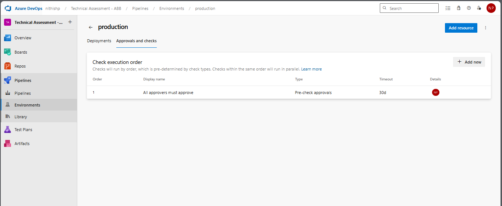
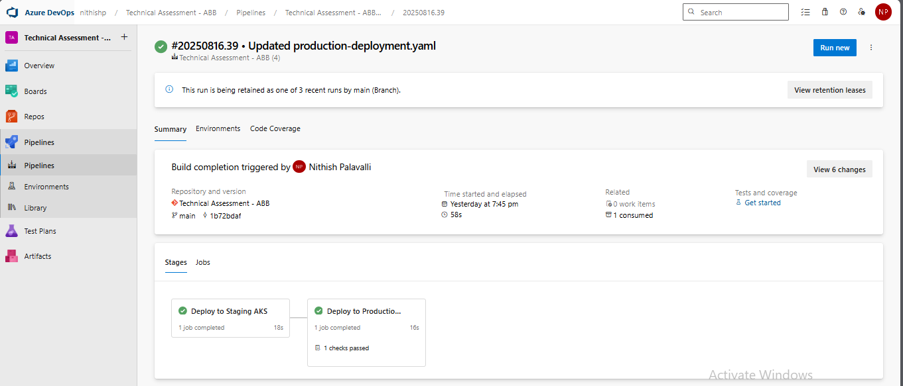

# Technical Assessment - CD Pipeline for .NET/Node.js Application

## Overview

This project extends the **Continuous Integration (CI) pipeline** by adding a **Continuous Deployment (CD) pipeline** in **Azure DevOps**.  
The CD pipeline deploys the application to **Azure Kubernetes Service (AKS)** with **approval gates for production**.  

Key highlights:
- Deploy to **Staging AKS environment** automatically after a successful CI run.  
- Deploy to **Production AKS environment** only after manual approval.  
- Uses artifacts produced by the CI pipeline.  
- Includes rollout verification with `kubectl rollout status`.  

---

## Pipeline

**Pipeline Name:** `cd-pipeline.yml`  

This pipeline consumes artifacts from the CI pipeline:  
- **Source pipeline:** `Technical Assessment - ABB`  
- **Artifact:** `drop` (contains application tarball + Kubernetes manifests)  

---

## Stages in CD Pipeline

### 1. **Deploy to Staging**
- Triggered automatically after CI pipeline success.  
- Deploys manifests to the **staging namespace** in AKS.  
- Steps performed:  
  - Download build artifact from CI.  
  - Authenticate with AKS using `az aks get-credentials`.  
  - Ensure `staging` namespace exists.  
  - Apply ConfigMap if available.  
  - Deploy application manifests with `kubectl apply`.  
  - Verify rollout using:  
    ```bash
    kubectl -n staging rollout status deployment/my-app --timeout=60s
    ```

### 2. **Deploy to Production**
- Triggered only after **Staging succeeds** *and* **approval is granted**.  
- Deploys manifests to the **production namespace** in AKS.  
- Steps performed:  
  - Download build artifact from CI.  
  - Authenticate with AKS.  
  - Ensure `production` namespace exists.  
  - Apply ConfigMap for production (if available).  
  - Deploy manifests with `kubectl apply`.  
  - Verify rollout with `kubectl rollout status`.  

---

## Approval Gates

- The **Production stage** has a manual approval gate in Azure DevOps Environments.  
- The deployment pauses until an authorized user approves it.  
- Screenshot example (to be added):  
    

---

## Artifacts and Outputs

1. **Deployment Logs**  
   - Logs from both staging and production deployments are captured.  
   - Example log file: `deployment-logs.txt`  
   - Example snippet:  
     ```text
     ##[section]Starting: Deploy to Staging AKS
     Successfully configured kubectl with AKS credentials.
     deployment.apps/my-app created
     Waiting for rollout to finish...
     deployment "my-app" successfully rolled out
     ```

2. **Screenshots**  
   - Approval prompt in Azure DevOps.  
   - Successful staging deployment view.  
   - Successful production deployment view.  

   Example placeholders:  
   -    

3. **Namespaces**  
   - Staging: `staging`  
   - Production: `production`  

---

## Logs

- The complete **deployment logs** are available in this repository.  
- File: **`deployment-logs.txt`** or similar.  
- Repo URL: 
  👉 [[View Staging Deployment Logs](https://github.com/NithishReddyGithub/CD-Pipeline/blob/main/Staging%20Deployment.txt)]
  👉 [[View Production Deployment Logs](https://github.com/NithishReddyGithub/CD-Pipeline/blob/main/Production%20Deployment.txt)]

---

## How to Run the Pipeline

1. Ensure CI pipeline (`Technical Assessment - ABB`) completes successfully and publishes artifacts.  
2. Trigger CD pipeline manually or automatically (based on CI trigger).  
3. Verify **Staging deployment** in AKS.  
4. Wait for **Production approval gate** in Azure DevOps:  
   - Approve when ready.  
   - Pipeline proceeds with production deployment.  
5. Monitor rollout logs and verify pods in `staging` and `production` namespaces.  

---
